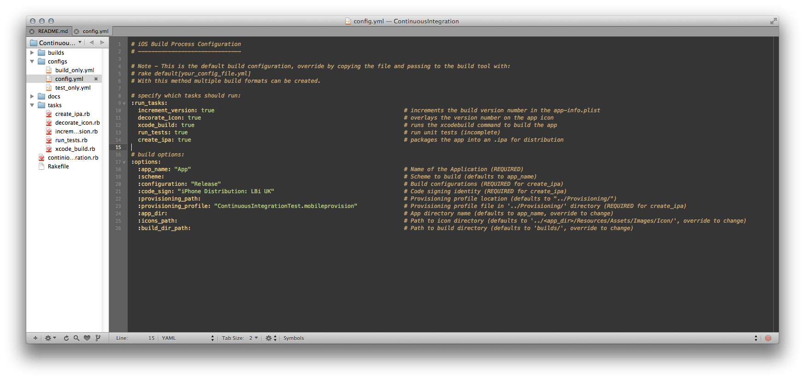
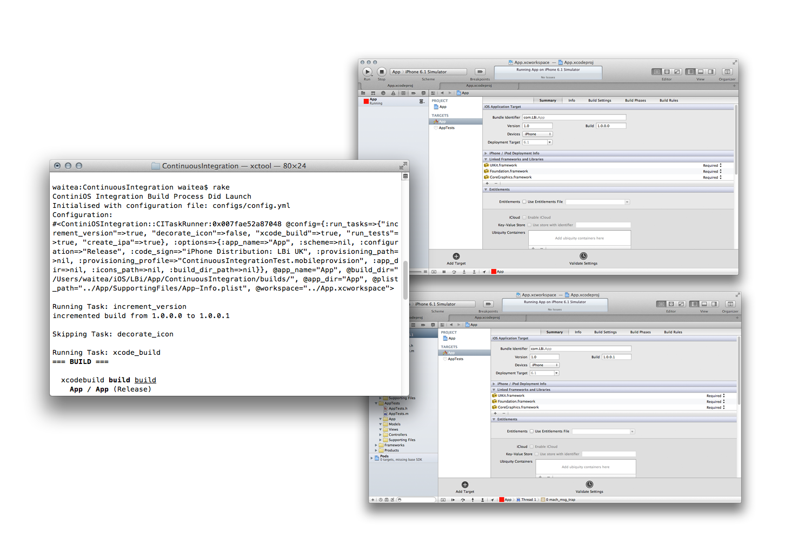
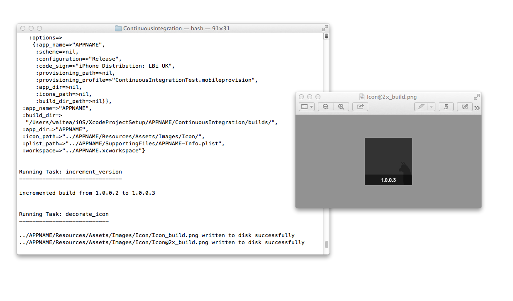
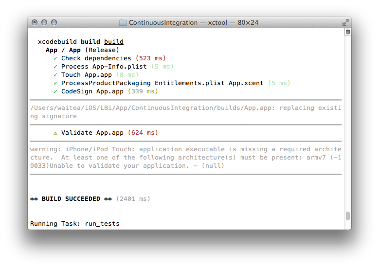
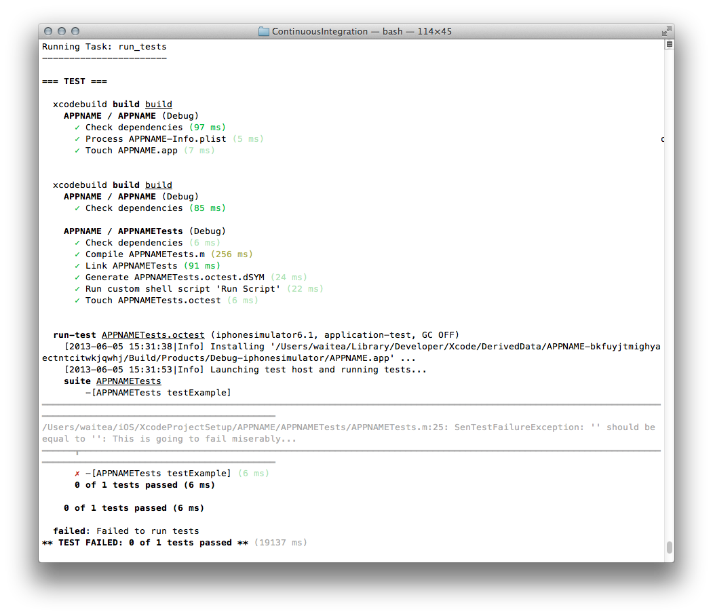
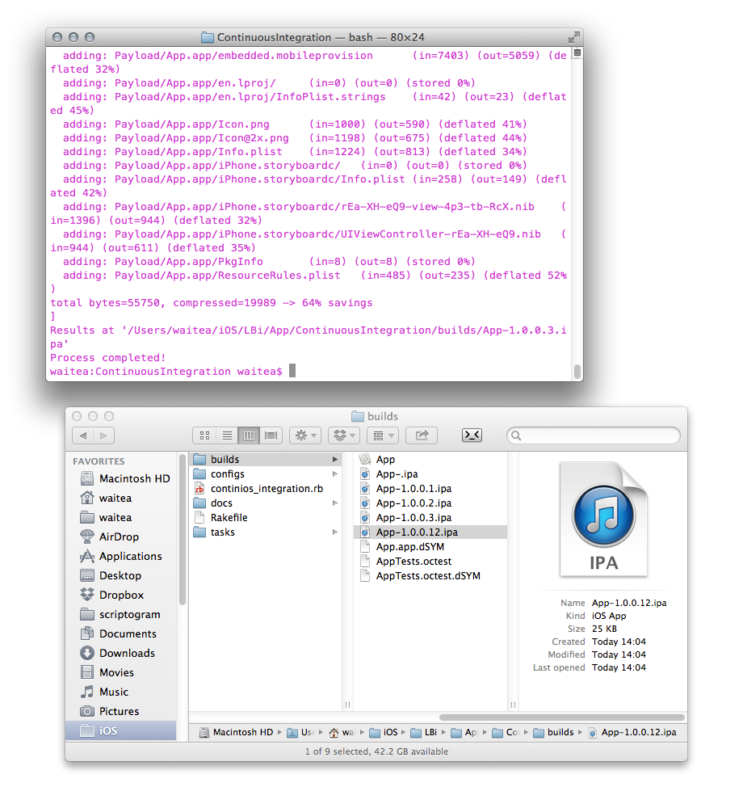
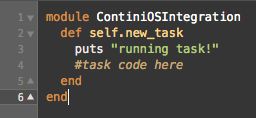

# Xcode iOS Project Configuration

**Features:**

- Clean and organised directory structure mapping filesystem directories to Xcode groupings.
- Pre-configured unit testing target with OCUnit.
- Highly customisable and extendable continuous integration toolkit written in Ruby. Existing tasks include:
    - Increment the build number
    - Overlay the build number on the application icon
    - Build the app
    - Run unit tests
    - Generate an .ipa artefact
- [CocoaPods](http://cocoapods.org) initialised xcworkspace for management of third party Objective-C dependencies.

## Prerequisites

As Mac OSX users and iOS developers it's most likely that the following are installed anyway, but just in case, ensure installation of:

1. **Xcode's command line tools:** (in the download tab of the Xcode preferences menu).

2. **Homebrew:** Two dependencies are installed with [Homebrew](http://mxcl.github.io/homebrew/) OSX package manager - [Facebook's xctool](https://github.com/facebook/xctool) for human readable CLI output and [ImageMagick](http://www.imagemagick.org) the code driven Photoshop. 

3. **Ruby Gems:** The continuous integration tooling is written in Ruby. [RubyGems](http://rubygems.org) is required to install some gems that power the toolkit, those being RMagick and Rake.

## Configuration

1. Fire up a terminal session and create a directory to house your new app:

        $ mkdir <CoolAppName>
2. Jump into the new directory:

        $ cd <CoolAppName>
3. Clone the repo:

        $ git clone git@github.com:adamwaite/XcodeProject.git
4. Run configure.rb:

        $ ruby configure.rb
   This will rename all the the paths, files and project setting to match the given application name, install: xctool, Imagemagick, RMagick, Rake, and finally trash any unecessary files such as this readme.
5. Write your app!

## Project Structure

In a Rails-like [convention over configuration](http://en.wikipedia.org/wiki/Convention_over_configuration) approach, and knowing that MVC is central to a good design for a Cocoa application, the application filesystem has been structured to house application code, tests, assets and data in an organised fashion. Filesystem directories are mapped to Xcode groups, no more messy project folders!

    ├── <AppName>
    	  ├── <AppName>
        │   ├── AppDelegate.h
        │   ├── AppDelegate.m
        │   ├── App
        │   ├── Build
        │   ├── Controllers
        │   │   ├── ViewController.h
        │   │   └── ViewController.m
        │   ├── Lib
        │   │   └── Categories
        │   ├── Models
        │   ├── Resources
        │   │   ├── Assets
        │   │   │   ├── Images
        │   │   │   │   ├── Default
        │   │   │   │   │   ├── Default-568h@2x.png
        │   │   │   │   │   ├── Default.png
        │   │   │   │   │   └── Default@2x.png
        │   │   │   │   └── Icon
        │   │   │   │       ├── Icon.png
        │   │   │   │       ├── Icon@2x.png
        │   │   │   ├── Sound
        │   │   │   └── Video
        │   │   └── Data
        │   ├── SupportingFiles
        │   │   ├── <AppName>-Info.plist
        │   │   ├── <AppName>-Prefix.pch
        │   │   ├── en.lproj
        │   │   └── main.m
        │   ├── Vendor
        │   └── Views
        │       └── iPhone.storyboard
        ├── <AppName>.xcworkspace
    ├── <AppName>.xcodeproj
        ├── <AppName>Tests
        │   ├── <AppName>
        │   ├── <AppName>Tests.h
        │   ├── <AppName>Tests.m
        │   ├── Controllers
        │   │   ├── ViewControllerTests.h
        │   │   └── ViewControllerTests.m
        │   ├── Models
        │   ├── SupportingFiles
        │   │   ├── <AppName>Tests-Info.plist
        │   │   └── en.lproj
        │   └── Views
        ├── ContinuousIntegration
        │   ├── Rakefile
        │   ├── builds
        │   ├── configs
        │   │   ├── config.yml
        │   ├── continios_integration.rb
        │   └── tasks
        │       ├── create_ipa.rb
        │       ├── decorate_icon.rb
        │       ├── increment_version.rb
        │       ├── run_tests.rb
        │       └── xcode_build.rb
        ├── Podfile
        ├── Podfile.lock
        ├── Pods
        │   ├── Manifest.lock
        │   └── Pods.xcodeproj
        │       └── project.pbxproj
        └── Provisioning

## OCUnit Testing Target

The app project has been configured with a unit-testing target. There is one existing test that compares `YES` to `NO` and fails, just to make sure everything is working as it should!

## CocoaPods Dependency Management

The configuration uses CocoaPods for management of Objective-C dependencies. The *podspec* is blank as is, to add dependencies add pods to the *Podfile*:

    pod 'AFNetworking'
    pod 'SocketRocket'
    pod 'Kiwi'

and run:

    $ pod install
    
For more information [see the CocoaPods getting started guide](http://cocoapods.org)

## ContiniOS Integration Toolkit

**Warning:** This is yet to be used and tested alongside a continuous integration server such as Bamboo or Jenkins and will likely require some tweaking! Expect updates here.

The continuous integration and build system tooling is written in Ruby and executed with [Rake](http://rake.rubyforge.org). Options are passed to the Rake process in the form a YAML configuration file that describes the build tasks to be run and any further options. 

The task structure is modular, new tasks can be added with no disruption of the existing process. Some of the tasks (including the test runner and the xcode_build task) wrap around [Facebook's xctool](https://github.com/facebook/xctool) system for human readable output.

**Features**

- Pass different configuration files to Rake to customise build process behaviour.
- Place new task modules in the *task/* directory to add new build functionality to the process.
- Included build modules:
	- increment_version - this increments the build number of the version in the plist
	- decorate_icon - uses RMagick to overlay the new version number on top of the icon files
	- xcode_build - build the application
	- run_tests - run the OCUnit tests
	- create_ipa - package the app into an .ipa file and place in the builds/ directory

### Configuration Files

Configuration files are in YAML format. The files are parsed by Ruby and passed to the system for execution.

All commands under the `:run_tasks` symbol are executed based on the boolean that follows. For example: `increment_version: true` means that the system will look in the *tasks/* directory and execute the method defined in the `increment_version.rb` file (convention of the filename matching the task). Setting a task to `false` will ensure that the tool to skips that task.

Any parameters under the `:options` symbol can be used to override defaults.

**Note** - The system is designed to work with the directory structure given above. For example, the system will look for the provisioning profiles to sign the app in the *../Provisioning/* directory unless. This behaviour can be overridden in the options.

The default configuration (currently) looks like this:

### Usage

Running:

    rake

Will launch the default build process and run the process defined in the **default configuration file:** *config.yml*.

Creating a custom config file in the configs directory and running:

    rake default configs/my_build_spec.yml

Will launch a build process with the configuration specified in the *my_build_spec.yml* file. With this set-up multiple processes can be defined by creating multiple config files.

### Existing Tasks

#### increment_version

Increments the version number in the App Plist:

#### decorate_icon

Decorates the icon with the version number:

#### xcode_build

Builds the project:

### run_tests

Runs unit tests:

#### create_ipa

Creates an .ipa file for install.

### Creating a New Task

Create a new task by dropping a *new_task.rb* file in the tasks directory. The task must be of format:

The task runner is defined in *continios_integration.rb*. 

Access configuration with (this needs work):

    runner = ContiniOSIntegration::CITaskRunner.instance
    config = runner.config

To run the new task, simply add a line containing the new task to the `:run_tasks` list in a config file to be passed to Rake (for example: `new_task: true`).

## Contributing

Pull requests welcome! Please feel free to tidy up my novice Ruby code!

## Contact

[@adamwaite](https://twitter.com/AdamWaite)

It would be great to know what you think.

## License

MIT

Copyright (c) 2013 Adam Waite. All rights reserved.

Permission is hereby granted, free of charge, to any person obtaining a copy
of this software and associated documentation files (the "Software"), to deal
in the Software without restriction, including without limitation the rights
to use, copy, modify, merge, publish, distribute, sublicense, and/or sell
copies of the Software, and to permit persons to whom the Software is
furnished to do so, subject to the following conditions:

The above copyright notice and this permission notice shall be included in
all copies or substantial portions of the Software.

THE SOFTWARE IS PROVIDED "AS IS", WITHOUT WARRANTY OF ANY KIND, EXPRESS OR
IMPLIED, INCLUDING BUT NOT LIMITED TO THE WARRANTIES OF MERCHANTABILITY,
FITNESS FOR A PARTICULAR PURPOSE AND NONINFRINGEMENT. IN NO EVENT SHALL THE
AUTHORS OR COPYRIGHT HOLDERS BE LIABLE FOR ANY CLAIM, DAMAGES OR OTHER
LIABILITY, WHETHER IN AN ACTION OF CONTRACT, TORT OR OTHERWISE, ARISING FROM,
OUT OF OR IN CONNECTION WITH THE SOFTWARE OR THE USE OR OTHER DEALINGS IN
THE SOFTWARE.

