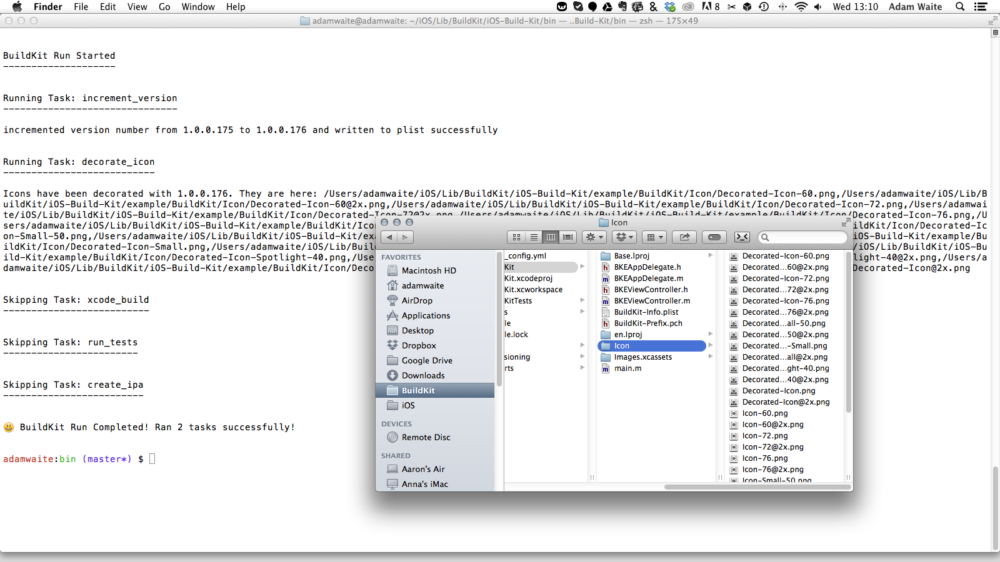

# iOS BuildKit

BuildKit is a modular command line interface for automating iOS project builds. BuildKit aims to relieve you from the pain of configuring continuous integration environments and build processes.

Bundled build tasks include:

- Increment the build number
- Draw the version number on the app icon
- Build the app
- Run unit tests
- Generate an .ipa artefact

BuildKit is distributed as a [Ruby gem](https://rubygems.org/gems/ios_build_kit) with an executable that can be launched either in a continuous integration server environment or on your development machine. The process is configured with a simple YAML file that describes the tasks to run and your project-specific options. This means that you can tailor the build process to meet your requirements.

It's compatible with the iOS7 and iOS8 SDK with Objective-C and Swift projects.

*Version: 0.0.6*


## Dependencies

- *Ruby > 2.0*: BuildKit is written and run with Ruby, you'll need a version higher than 2.0 because of the modern syntax. Check your Ruby version with `ruby -v`. [RVM](http://rvm.io/) makes it easy should you need to update.
- *Xcode command line tools*: `xcode-select --install`
- *ImageMagick*: Command line graphics library used to draw on the app icon. Install with: `brew install imagemagick`.
- *GhostScript*: Command line text rendering library used to draw the version number on the app icon. Install with: `brew install ghostscript`.

## Installation

After the dependencies have been installed, BuildKit can be installed with:

`gem install ios_build_kit`

## Usage

BuildKit is launched from a command line environment with:

```
buildkit
```

Pass a configuration file to BuildKit with:

```
buildkit your-config-file.yml
```

### Configuration Files

The configuration file describes three things:

1. Task modules to run (and task-specific options)
2. Project configuration
3. User preferences

An example configuration file:

```yaml
:tasks:
  :increment_version:
    :run: true
    :options:
  :decorate_icon:
    :run: true
    :options:
  :xcode_build:
    :run: true
    :options:
      :log: true
      :clean: true
  :run_tests:
    :run: false
    :options:
    	:log: true
  :create_ipa:
    :run: true
    :options:
    	:log: true

:configuration:
  :app_name: "BuildKit"
  :workspace: "BuildKit.xcworkspace"
  :info_plist: "BuildKit/BuildKit-Info.plist"
  :build_configuration: "Release"
  :scheme: "BuildKit"
  :sdk: "iphoneos"
  :provisioning_profile: "Provisioning/BuildKitTest.mobileprovision"
  :code_sign: "iPhone Distribution: Alpaca Labs"
  :icon_dir: "BuildKit/Icon/"
  :build_dir: "Builds"

:preferences:
  :reports: "Reports"
```

#### Setting Tasks

The `:tasks:` symbol is used to define what tasks you would like your process to run. If `:run:` is set to `true` on a particular task then that task will be executed as part of the build process. Setting `:run:` to `false` will mean that the task is skipped (note that some tasks depend on others, and may cause a graceful failure). In the examle above all tasks but for `run_tests` will be executed.

The tasks will be run in the order that they appear in the list. It's recommended to follow the order shown in the example as they've been ordered to provide the best value to the process. In the example:
1. The build version is incremented with `increment_version`
2. The newly incremented version is rendered on the app icon with `decorate_icon`
3. Lastly `xcode_build` and `create_ipa` are run to build and create an ipa, which if installed on a device, will have the version number overlayed on the icon.

Anything passed with the `:options:` symbol will be provided as an option. For example, taking the example configuration file above the `:log:` option on the `run_tests` task is set to `true` so the test output will be printed to the CLI.

The Tasks section in this README describes all of the options available to each task.

#### Setting Project Configuration

To run the task modules successfully requires some project-specific configuration, this is done under the `:configuration:` symbol.

- `:app_name:`: Your app's name!
- `:workspace:`:  The path to your workspace (note that single Xcode project files aren't supported).
- `:info_plist:`: The path to your app's main info-plist file.
- `:build_configuration:`: Your build configuration (normally "Release" or suchlike)
- `:scheme:`: Project scheme to build
- `:sdk:`: SDK to build with (example: "iphoneos")
- `:provisioning_profile:`: Path to a provisioning profile to sign the app with.
- `:code_sign:`: The code signature, this is found in Xcode next to a selected provisioning profile (example: "iPhone Distribution: Alpaca Labs"). I recommend this [OSX quick look plug in](https://github.com/chockenberry/Provisioning) if you want to inspect profiles.
- `:icon_dir:`: The path to a directory containing you icon image files. More on this in the Tasks `decorate_icon` section of this README.
- `:build_dir:`: The path to drop any build and ipa files after they have been created.

Note: if some required configuration has not been provided, or an invalid location has been provided for an option that requires a path, then BuildKit will gracefully fail.

#### Setting User Preferences

BuildKit can be configured to suit your own preference too. This is done under the `:preferences:` symbol. For example, to switch on build report generation set the `:reports:` symbol to `true`. User preferences are further described in the User Preferences section of this README.

## Build Tasks

BuildKit comes packaged with the following task modules:

- `increment_version`: Increment the build number
- `decorate_icon`: Overlay the version number on the app icon
- `xcode_build`: Build the app
- `run_tests`: Run unit tests
- `create_ipa`: Generate an .ipa artefact

### increment_version

Increments the build version number in the Info-plist.

Requires configuration:
- `:info_plist:`

### decorate_icon

Duplicates your app icon files and renders the version number on top (incremented with `increment_version` or not).



**Decorate icon requires some convention for optimal usage**:

1. The app icon files should be contained in a dedicated directory of their own.
2. Drop the icon directory in to Xcode as a folder reference rather than a group.
3. Set the icon files in your Info-plist as:

```
<key>CFBundleIcons</key>
<dict>
	<key>CFBundlePrimaryIcon</key>
	<dict>
		<key>CFBundleIconFiles</key>
		<array>
			<string>CONTAININGFOLDER/Decorated-ICONFILENAME</string>
			<string>CONTAININGFOLDER/Decorated-ICONFILENAME</string>
			<string>CONTAININGFOLDER/Decorated-ICONFILENAME</string>
		</array>
	</dict>
</dict>
```

If you're unsure check the example project.

Requires configuration:
- `:info_plist:`
- `:icon_dir:`

### xcode_build

Builds the project (with optional clean before build).

Options:
- `log`: logs the output to the console
- `clean`: clean before build

Requires configuration:
- `:app_name:`
- `:workspace:`
- `:sdk:`
- `:build_configuration:`
- `:build_dir:`
- `:scheme:`

*Note: Special thanks to [@supermarin](https://github.com/supermarin) for making the output beautiful with his [xcpretty](https://github.com/supermarin/xcpretty) gem (same for `run_tests`)*

### run_tests

Runs unit tests. XCTest, [Kiwi](https://github.com/allending/Kiwi) and [Specta/Expecta](https://github.com/specta/specta) are all supported

Options:
- `log`: logs the output to the console

Requires configuration:
- `:workspace:`
- `:scheme:`

### create_ipa

Creates an .ipa build artefact and drops it in build directory specified in the config file.

Options:
- `log`: logs the output to the console

Requires previous tasks:
- `xcode_build`

Requires configuration:
- Everything required for `xcode_build`

## User Preferences

BuildKit includes some user preferences that can be enabled under the `:preferences:` symbol of a config file.

### User Preferences: Create Reports

Set `:reports:` to a directory in your config file to create a JSON report containing the project configuration, build time, build outputs and test outputs after a BuildKit run has completed.

Leaving the `:reports:` preference blank will skip report generation.

## Examples

An example workspace has been included in the repo if you want to try it out. You may need to change the paths in the `build_config.yml` configuration file first and run a `pod install`.

## Roadmap

Lots of plans for BuildKit:

- Create a build task module to enable artefact distribution by wrapping [Shenzhen](https://github.com/nomad/shenzhen) (in progress).
- Add a generator for config files (next up).
- Add a means to allow custom task modules to be added to the process.
- Make `decorate_icon` compatible with Xcode 5 asset catalogues.

## Contributing

All pull requests welcome! Please ensure that all existing RSpec specs pass, and that any new features are covered with specs. Please keep the README up to date. Run specs from the root directory with `rspec spec`.

## Contact

[@adamwaite](https://twitter.com/AdamWaite)

## Build Errors

And finally, a list of cryptic build error annoyances and how to deal with them:

- [ResourceRules.plist: cannot read resources](https://stackoverflow.com/questions/26497863/xcode-6-1-error-while-building-ipa/26499526#26499526)

- [codesign failed with exit code 1](https://stackoverflow.com/questions/26497863/xcode-6-1-error-while-building-ipa/26499526#26499526)

## License

Copyright (c) 2014 Adam Waite. All rights reserved.

Permission is hereby granted, free of charge, to any person obtaining a copy
of this software and associated documentation files (the "Software"), to deal
in the Software without restriction, including without limitation the rights
to use, copy, modify, merge, publish, distribute, sublicense, and/or sell
copies of the Software, and to permit persons to whom the Software is
furnished to do so, subject to the following conditions:

The above copyright notice and this permission notice shall be included in
all copies or substantial portions of the Software.

THE SOFTWARE IS PROVIDED "AS IS", WITHOUT WARRANTY OF ANY KIND, EXPRESS OR
IMPLIED, INCLUDING BUT NOT LIMITED TO THE WARRANTIES OF MERCHANTABILITY,
FITNESS FOR A PARTICULAR PURPOSE AND NONINFRINGEMENT. IN NO EVENT SHALL THE
AUTHORS OR COPYRIGHT HOLDERS BE LIABLE FOR ANY CLAIM, DAMAGES OR OTHER
LIABILITY, WHETHER IN AN ACTION OF CONTRACT, TORT OR OTHERWISE, ARISING FROM,
OUT OF OR IN CONNECTION WITH THE SOFTWARE OR THE USE OR OTHER DEALINGS IN
THE SOFTWARE.
